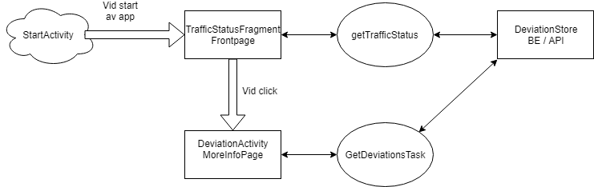
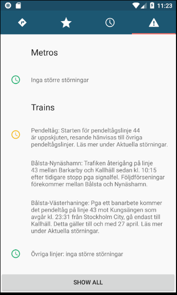

# Deviation 

# Deviation

## trafficStatusFragment

Sidan för störningar skapas direkt när appen öppnas genom denna klass.

## getTrafficStatus

## deviationStore

## getDevTask

## fillData

## deviationActivity

## deviationStore
