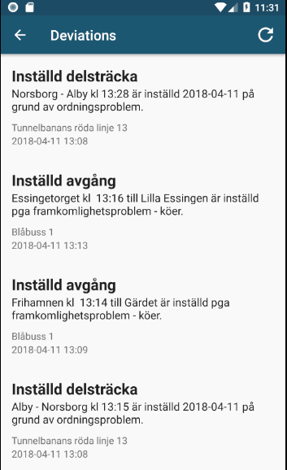

# Deviation 


# Deviation

## trafficStatusFragment

The page for deviations is created upon app launch, through this class


getTrafficStatus is a method in deviationStore which is called upon by the private class GetTrafficStatusTask. The method returns a type called 'TrafficStatus' which gives a "rating" for the current deviations affecting each way of transportation. It also provides the user with info about the devication cause. 

```
private class GetTrafficStatusTask
```
```
public TrafficStatus getTrafficStatus(final Context context) 
```

## deviationStore
Kommunicerar med SLs API för störningar i trafiken för att organiserea och hämta störningar just nu. Sparar störningar som typen "deviation" i en ArrayList genom getDeviations, som sedan returnerar listan.

``` 
public ArrayList<Deviation> getDeviations(final Context context)
```


## deviationsActivity

  ## getDeviationTask
  Använder sig av deviationstore, som getTrafficStatus, men skillnaden är att getDeviationTask visar mer noggrann info under "show all" in deviations.
  
```
 private void fillData(ArrayList<Deviation> result) 
```
  This function transforms the deviation data and allows for it to be printed on the display.
