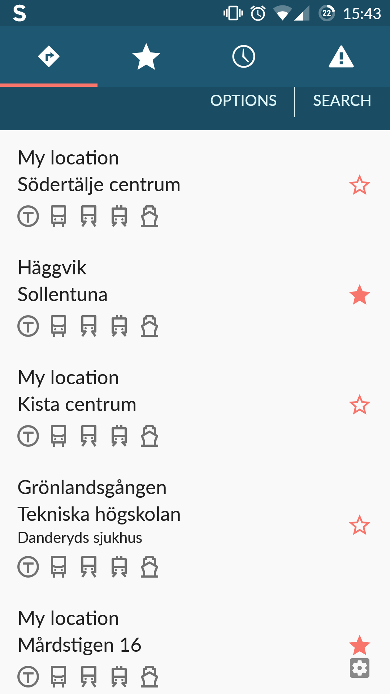

# Journeys
All favorites (starred journeys) begin as journey entries in the journeys table in journeys.db. This database file is primarily handled by JourneysProvider.
Journeys are starred or unstarred by toggling the star icons in the PlannerFragment view or the RoutesActivity view. (code line 730
All starred journeys are loaded and displayed in the FavoritesFragment view.
The class FavoritesDbAdapter and corresponding database favorite.db seem to only exist for backwards compatibility and are not used.

## PlannerFragment

The five latest journeys are displayed here, in order of most recently modified. Non-starred journeys outside of the 5 most recent are deleted.
inflateView

## RoutesActivity

## FavoritesFragment
