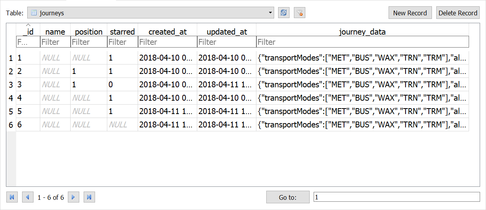
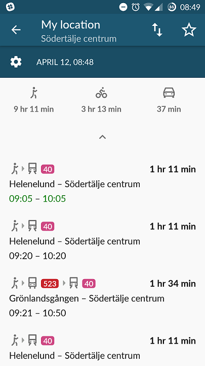
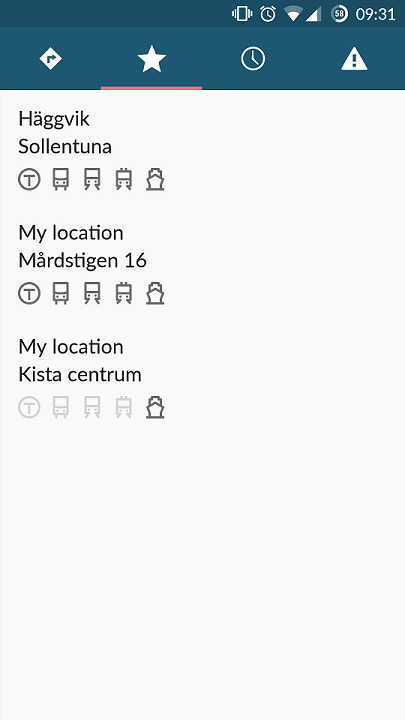

# Favorites and Journey history
All favorites (starred journeys) begin as journey entries in the journeys table in journeys.db. This database file is primarily handled by JourneysProvider.
Journeys are starred or unstarred by toggling the star icons in the PlannerFragment view or the RoutesActivity view.
All starred journeys are loaded and displayed in the FavoritesFragment view.
The class FavoritesDbAdapter and corresponding database favorite.db seem to only exist for backwards compatibility and are not used.


The journey_data column contains JSON data about the journey. Example:
`{"transportModes":["MET","BUS","WAX","TRN","TRM"],"alternativeStops":false,"origin":{"id":"1094","name":"Körsbärsvägen","latitude":59348411,"longitude":18064758,"source":0,"locality":"Stockholm"},"destination":{"id":"9204","name":"Tekniska högskolan","latitude":59345543,"longitude":18071707,"source":0,"locality":"Stockholm"}}`

## PlannerFragment


The five latest journeys are displayed here, in order of most recently modified. Non-starred journeys outside of the 5 most recent are deleted, but even starred journeys are not preferentially displayed or sorted here.

Code relating to the toggling of favourites is found inflateView:
<details>
<summary>Click to toggle contents of `code`</summary>
```java
CheckBox starred = (CheckBox) v
                    .findViewById(R.id.journey_star_check);
            boolean isStarred = c.getInt(COLUMN_INDEX_STARRED) == 1;
            if (isStarred) {
                starred.setChecked(true);
            } else {
                starred.setChecked(false);
            }

            final int id = c.getInt(COLUMN_INDEX_ID);

            // TODO: Refactor so we can re-use the same click listener.
            // We're using a click listener instead of an checked listener to
            // avoid callbacks if the list is modified from code.
            starred.setOnClickListener(new View.OnClickListener() {

                @Override
                public void onClick(View v) {
                    boolean isChecked = ((CheckBox) v).isChecked();
                    Uri uri = ContentUris.withAppendedId(Journeys.CONTENT_URI, id);
                    ContentValues values = new ContentValues();
                    if (isChecked) {
                        values.put(Journeys.STARRED, 1);
                    } else {
                        values.put(Journeys.STARRED, 0);
                    }
                    getActivity().getContentResolver().update(uri, values,
                            null, null);

                }
            });
```
</details>

## RoutesActivity


## FavoritesFragment

