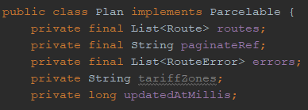
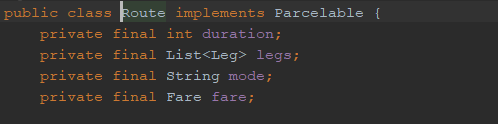
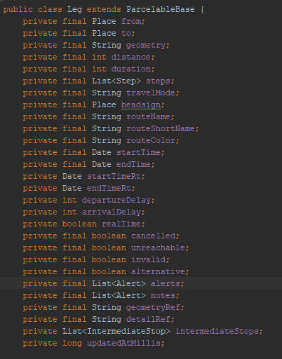
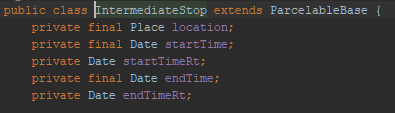

# Objects

## Plan
  
The plan object consists of:  
- A list of routes  
- A long describing how many miliseconds ago it was updated  
- A list of routeError objects.  
The plan object is used to list the available routes from one location to another.  

## Route
  
The route object consists of:  
- An int called "Duration" describing how long the trip will take  
- A list of leg objects  
- A string "mode" describing the different traveling modes  
- A boolean "Fare" describing if ticket purchases can be made for this trip  
The route is used to describe how the different trips look, e.g. how long it takes, if it goes by boat or train etc...  

## Leg
  
The leg object consists of information that the route uses to display the different parts of the trip to the user.  
For example if a user needs to take a bus and a train afterwards this would result in two separate legs.

## IntermediateStop
  
The intermediate stop is used during trips if the user will have to switch between two legs and wait for a period inbetween.
The intermediate stop object consists of:  
- A location describing in GPS coordinates where the stop is  
- A starttime stating when the stop "starts"
- A starttime in realtime stating in realttime when the stop "starts"
- A stoptime stating when the trip continues
- A stoptime in realtime when the trip continues

## TravelMode 
Consists of a string corresponding to a travel mode (ie. bus, train etc.)
## TravelModeQuery
Consists of a list with TravelMode objects
## JourneyQuery 
Consists of public Site origin;
    Site destination;
    Site via;
    Date time;
    boolean isTimeDeparture = true;
    boolean alternativeStops = false;
    List<String> transportModes = new ArrayList<>();
    String ident;
    boolean hasPromotions;
    nt promotionNetwork = -1; 
    String previousIdent;
    String previousDir;
